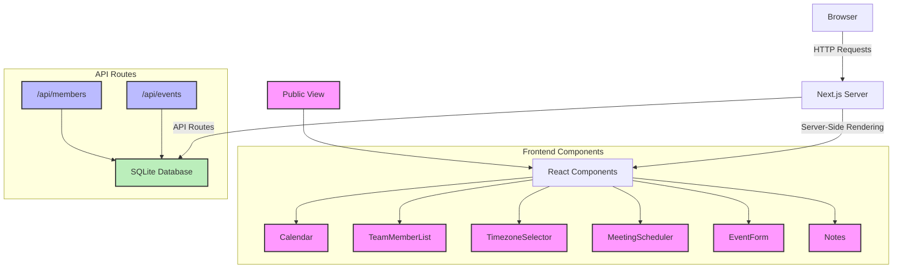

# TimeSync - Team Scheduling Application


TimeSync is a comprehensive team scheduling application designed to simplify the process of coordinating meetings across different time zones. It provides an intuitive interface for managing team members, their availability, and scheduling events.

## Table of Contents

- [Tech Stack](#tech-stack)
- [Features](#features)
- [Project Structure](#project-structure)
- [Getting Started](#getting-started)
- [Usage](#usage)
- [API Routes](#api-routes)
- [Contributing](#contributing)
- [License](#license)

## Tech Stack

- **Frontend**:
  - Next.js 13: React framework for building the user interface
  - React 18: JavaScript library for building user interfaces
  - TypeScript: Typed superset of JavaScript
  - Tailwind CSS: Utility-first CSS framework for styling
  - shadcn/ui: Reusable UI components built with Radix UI and Tailwind CSS

- **Backend**:
  - Next.js API Routes: Serverless functions for handling API requests
  - SQLite: Lightweight, serverless database for storing application data
  - sqlite3: SQLite driver for Node.js
  - sqlite: Promise-based wrapper for sqlite3

- **Development Tools**:
  - ESLint: JavaScript linter for identifying and reporting code issues
  - Prettier: Code formatter for maintaining consistent code style

## Features

- Interactive team calendar with week and 2-week views
- Team member management with customizable availability
- Timezone selection for accurate scheduling across different regions
- Meeting scheduler with Zoom integration (placeholder)
- Event creation and management
- Team notes for collaborative communication
- Public view for sharing team schedules

## Project Structure

```
time-sync/
├── app/
│   ├── api/
│   │   ├── events/
│   │   │   └── route.ts
│   │   └── members/
│   │       └── route.ts
│   ├── public/
│   │   └── [id]/
│   │       └── page.tsx
│   ├── layout.tsx
│   └── page.tsx
├── components/
│   ├── AddMemberForm.tsx
│   ├── Calendar.tsx
│   ├── EventForm.tsx
│   ├── MeetingScheduler.tsx
│   ├── Notes.tsx
│   ├── TeamMemberList.tsx
│   └── TimezoneSelector.tsx
├── public/
│   └── ...
├── styles/
│   └── globals.css
├── .gitignore
├── next.config.js
├── package.json
├── README.md
├── tsconfig.json
└── when2meet.db
```

## Project Architecture

The following diagram illustrates the high-level architecture and component structure of the TimeSync application:



This diagram shows:
- The main components of the application
- The flow of data between the frontend, backend, and database
- The relationship between different parts of the system

The TimeSync application uses a Next.js server for both server-side rendering of React components and handling API routes. The SQLite database is used to store and retrieve data about team members and events. The frontend is composed of several React components that interact with the backend through API routes.

## Getting Started

To get the When2Meet application up and running on your local machine, follow these steps:

1. **Clone the repository:**

```plaintext
git clone https://github.com/kambojananya/time-sync.git
cd time-sync
```


2. **Install dependencies:**

```plaintext
npm install
```


3. **Set up the SQLite database:**
The application will automatically create and initialize the SQLite database file (`when2meet.db`) when you first run it.
4. **Run the development server:**

```plaintext
npm run dev
```


5. **Open the application:**
Navigate to [http://localhost:3000](http://localhost:3000) in your web browser to see the application running.


## Usage

Here's a guide on how to use the main features of the When2Meet application:

1. **Team Member Management:**

  1. Click the "Add Team Member" button in the TeamMemberList component.
  2. Fill in the member's name, select their timezone, and set their availability in the form.
  3. Click "Add Member" to save the new team member.


2. **Calendar View:**

  1. The main Calendar component displays team member availability.
  2. Use the "Week View" and "2 Weeks View" buttons to toggle between different calendar views.
  3. Navigate between weeks using the arrow buttons next to the date range.


3. **Timezone Selection:**

  1. Use the TimezoneSelector component to set your preferred timezone.
  2. This ensures that you see schedules accurately across different regions.


4. **Meeting Scheduler:**

  1. Use the MeetingScheduler component to set up new meetings.
  2. Enter the meeting title, date, and time.
  3. Click "Schedule Meeting" to create the meeting (Note: Zoom integration is a placeholder).


5. **Event Creation:**

  1. Use the EventForm component to add new events to the calendar.
  2. Specify the event title, day, start time, end time, and duration.
  3. Click "Add Event" to create the new event.


6. **Team Notes:**

  1. Use the Notes component to add and save team notes.
  2. Enter your notes in the text area and click "Save Notes" to store them.


7. **Public View:**

  1. Click the "View Public Schedule" link to access a shareable public view of the team's schedule.


## API Routes

The When2Meet application uses the following API routes:

1. **Members API:**

1. Endpoint: `/api/members`
2. Methods:

1. GET: Fetch all team members
2. POST: Add a new team member


3. Example usage:

```javascript
// Fetch members
const response = await fetch('/api/members');
const members = await response.json();

// Add a new member
const newMember = { name: 'John Doe', timezone: 'UTC', availability: {...} };
await fetch('/api/members', {
  method: 'POST',
  headers: { 'Content-Type': 'application/json' },
  body: JSON.stringify(newMember)
});
```


2. **Events API:**

1. Endpoint: `/api/events`
2. Methods:

1. GET: Fetch all events
2. POST: Add a new event


3. Example usage:

```javascript
// Fetch events
const response = await fetch('/api/events');
const events = await response.json();

// Add a new event
const newEvent = { title: 'Team Meeting', day: 'Monday', startTime: '10:00', endTime: '11:00', duration: 1 };
await fetch('/api/events', {
  method: 'POST',
  headers: { 'Content-Type': 'application/json' },
  body: JSON.stringify(newEvent)
});
```


These API routes handle the creation and retrieval of team members and events, interfacing with the SQLite database.

